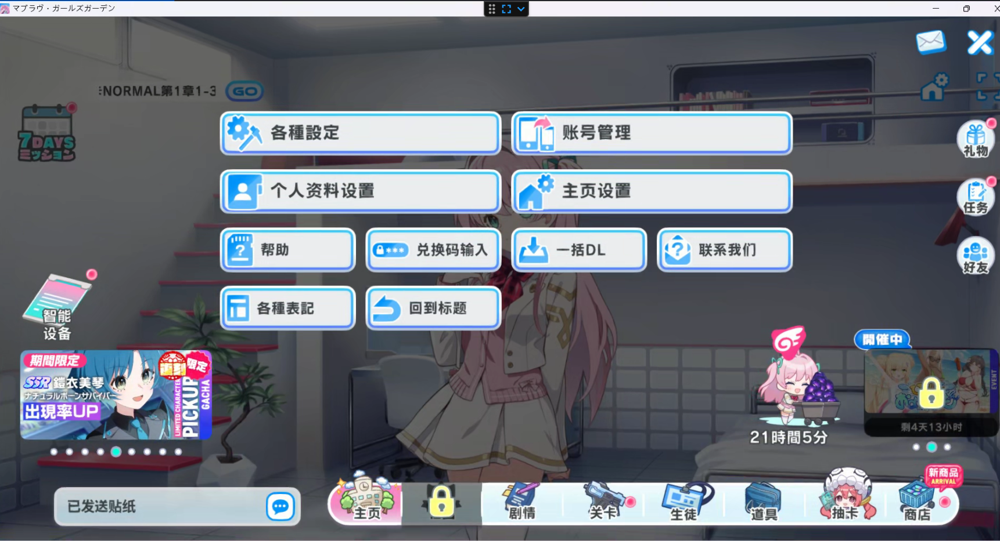

# 少女庭园 UI 汉化（MuvluvUiTranslate）

《マブラヴ・ガールズガーデン（少女庭园 / Muv-Luv Girls Garden）》的 **UI 全量中文化**插件，BepInEx 6 IL2CPP 插件，通过全局 Hook TextMeshPro 文本通道 + 本地日中词典实现运行时替换。



## 与上游 MuvluvMod 的关系

本插件与上游 [MuvluvMod](https://github.com/anosu/muvluvgg-translation)（anosu）**共存、互补**，需先安装上游：

| 分工 | 上游 MuvluvMod | 本插件 MuvluvUiTranslate |
|---|---|---|
| 剧情/MasterData 翻译 | ✅ | ❌（明确不碰，避免重复翻译） |
| 中文字体兜底 | ✅ | 依赖上游 |
| 其余全部 UI 文本 | ❌ | ✅ 本插件翻译兜底 |

## 工作原理

### 翻译通道（Harmony Hook，`TmpTextPatches.cs`）

游戏所有 UI 文本最终都流经 TextMeshPro，Hook 三个入口即可全覆盖（已用 Il2CppDumper 的 dump.cs 验证无子类 override）：

1. **`TMP_Text.set_text`** Prefix——运行时 `text = "..."` 赋值主通道，命中词典即改写入参；
2. **`TMP_Text.SetText(string, float×0..8)`** 9 个重载 Prefix——内部直写 `m_text` 不走 setter 的旁路；
3. **`TextMeshPro` / `TextMeshProUGUI` 的 `OnEnable`** Postfix——prefab 烘焙进 `m_text` 的静态文本（反序列化不调 setter），激活时统一补翻。

### 捕获通道（`CaptureRecorder.cs`）

- 只捕获**含假名**的未命中日文（平/片假名判据，排除 `・` U+30FB——它会出现在中文译名里）；
- 纯汉字日文（如「設定」）运行时照翻、但不捕获（无法与上游已译中文区分），由里程碑 2 的静态扫描补齐；
- 跳过 `TextViewText` 打字机组件（逐字刷新的剧情通道，归上游）；
- 去重计数、跨运行累计、原子落盘到 `translation/capture/zh_Hans.pending.json`。

### 词典（`translation/ui/zh_Hans.json`）

```jsonc
{
  "exact": { "クリックしてスタート": "点击开始" },          // 整串精确匹配
  "patterns": [
    { "re": "^あと(\\d+)日(\\d+)時間$", "tpl": "剩{0}天{1}小时" } // 正则模板，数字归并
  ]
}
```

- key/模板必须与游戏内文本**逐字符一致**（含 TMP 富文本标签 `<sprite>`/`<color>`、换行、首尾空格）；
- exact 优先于 patterns；
- **游戏内按 F10 热重载**，改完词典不用重启。

## 安装

1. 前置：游戏本体（DMM 版）+ BepInEx 6 IL2CPP（be.785）+ 上游 MuvluvMod；
2. 从 [Releases](https://github.com/delayboy/girlsgarden_translate/releases) 下载 zip，解压到游戏根目录（合并 `BepInEx/plugins/MuvluvUiTranslate/`）；
3. 进游戏即生效。

配置文件 `BepInEx/config/benson.muvluvuitranslate.cfg`：

| 配置项 | 默认 | 说明 |
|---|---|---|
| `Translation.Enabled` | true | 启用 UI 翻译 |
| `Capture.Enabled` | true | 捕获未翻译日文到 pending.json |
| `Capture.LogLimit` | 30 | 每次运行写入 BepInEx 日志的未翻译条数上限（0 关闭） |

## 翻译工作流（众包/自用迭代）

```
玩游戏(捕获) → clean_capture.py 清洗 → 机翻脚本入库 → 游戏 F10 热重载 → 人工校对
```

`tools/` 下三个脚本，**注意 python 环境区分**：

| 脚本 | 环境 | 作用 |
|---|---|---|
| `clean_capture.py` | **python-ba** | 剔除 TextViewText 噪声与无假名串 |
| `translate_pending_google.py` | 默认 python | **Google 免费翻译**全量入库（哨兵占位保标签/换行/术语） |
| `translate_pending.py` | 默认 python | DeepSeek 精翻（挂术语表，适合精修） |

### Google 版（批量草稿，免费无 key）

```bash
python tools/translate_pending_google.py --dry-run   # 先看待翻清单
python tools/translate_pending_google.py             # 正式翻译并入词典
```

要点：送翻前把 TMP 标签、换行、术语表全部替换成 `⟦n⟧` 哨兵，回填时校验哨兵全部存活，任何丢失该条作废进 failed 清单——**绝不写坏词典**；术语（クエスト→关卡 等 30 词）回填规范译名保证全局一致；已被 patterns 覆盖的条目自动跳过；Google 草稿记录在 `zh_Hans.google_log.json`，供日后 DeepSeek 精修。

### DeepSeek 版（精翻）

```bash
python tools/translate_pending.py --dry-run
python tools/translate_pending.py               # 需 DeepSeek API key
```

依赖 `PyTools` 包（DeepSeekChat 封装）在工作目录根。

## 构建 / 打包 / 发版

```bash
# 构建（MuvluvUiTranslate/ 内自带一份 BepInEx 编译环境；也可指向真实游戏目录）
dotnet build MuvluvUiTranslate -p:GameDir=C:\你的游戏目录

# 一键打包 release zip（白名单只含 BepInEx/plugins/MuvluvUiTranslate）
python one_click_main.py

# 上传 GitHub Release（认证走 GITHUB_TOKEN 或 git 凭据管理器）
python publish_release.py
```

## 目录结构

```
MuvluvUiTranslate/        插件源码（csproj + 7 个 .cs）+ 自带 BepInEx 编译环境
  Plugin.cs               入口：配置/词典/捕获初始化，Harmony PatchAll
  TmpTextPatches.cs       三类 TMP Hook
  UiDictionary.cs         词典加载/匹配（不可变快照热替换）
  CaptureRecorder.cs      捕获去重计数、原子落盘
  UiTranslateManager.cs   F10 热重载、定时 flush
  Config.cs               BepInEx 配置项
tools/                    翻译管线脚本（见上）
build_example/            构建产物示例（dll + translation）
Il2CppDumper-win-v6.7.46/ 逆向工具（里程碑 2 静态扫描用）
dump.cs                   Il2CppDumper 导出的全量类信息（Hook 点验证依据）
少女庭园UI翻译计划书.md     项目计划书
进展总结.md                进展记录
```

## 路线图

- [x] 里程碑 1：插件 + 词典 v1 + 捕获→机翻管线，游戏内实测生效
- [ ] 里程碑 2：静态扫描补齐运行时捕获盲区（Il2CppDumper 字符串字面量 + UnityPy 扫 295 个 bundle 的 m_text，覆盖纯汉字日文与未访问界面）
- [ ] 术语库自动扩充（从上游翻译仓库提取译名）
- [x] Google 草稿批量 LLM 精修（`zh_Hans.google_log.json` 清单驱动）：Google应对UI翻译足够，暂缓执行

## 致谢

- [MuvluvMod](https://github.com/anosu/muvluvgg-translation)（anosu）——剧情/MasterData 翻译与中文字体兜底
- [BepInEx](https://github.com/BepInEx/BepInEx) / [Il2CppInterop](https://github.com/BepInEx/Il2CppInterop) / [Harmony](https://github.com/pardeike/Harmony)
- [Il2CppDumper](https://github.com/Perfare/Il2CppDumper)、[deep_translator](https://github.com/nidhaloff/deep-translator)
